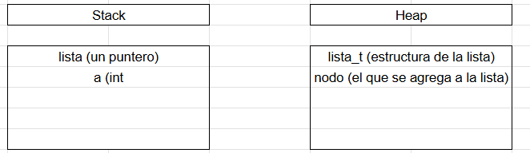
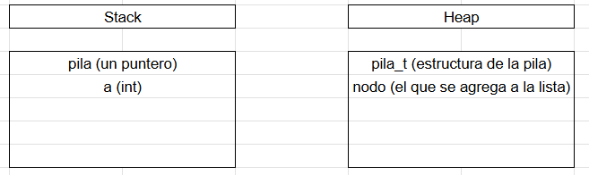
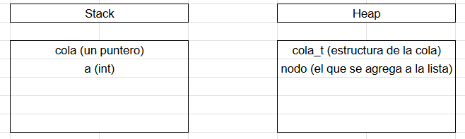

<div align="right">

</div>

# TDA LISTA/PILA/COLA

## Repositorio de (Jose Gonzalez Casartelli) - (113633) - (jgcasartelli06@gmail.com)

- Para compilar:

```bash
make
```

- Para ejecutar:

```bash
make run ARGS="..." 
```

ejemplo de uso --> make run ARGS="pokemones.csv buscar nombre Pikachu"

- Para ejecutar con valgrind:
```bash
make valgrind ARGS="..."
```
---
##  Funcionamiento

El programa funciona abriendo un archivo pasado por parámetro y lo lee línea por línea.  Parsea cada línea según los campos del struct y los intenta guardar en un vector.  Esto lo hace utilizando la función leer_archivo() del tp1 que se usa para luego cargar la lista con todos los elementos.  Se hace llamando a la función lista_crear() que crea una lista donde inicializamos un puntero que apunta al primer elemento de la lista, uno que apunta al último y la cantidad.  La estructura está definida de esta forma para poder tener una complejidad de O(1) en las operaciones encolar, desencolar y frente de la cola, y apilar, desapilar y tope de la pila.

```c
lista_t *lista_crear()
{
    lista_t *lista = malloc(sizeof(lista_t));
    if (!lista)
        return NULL;
    
    lista->primero = NULL;
    lista->ultimo = NULL;
    lista->cantidad = 0;

    return lista;

}
```

La lista es simplemente enlazada donde contiene nodos y cada nodo almacena un dato y un puntero al siguiente nodo.  Por la forma en la que está definida la estructura, las funciones lista_agregar() y lista_cantidad() tienen complejidad O(1).  Lista_cantidad() simplemente devuelva la cantidad de nodos en la lista accediendo directo al campo cantidad.  Lista_agregar() agrega un elemento al final de la lista.  La razón por la que esta función es O(1) es porque tenemos un puntero al último nodo y ese nodo contiene un puntero que en ese momento apunta a NULL. Lo que se hace es que lista->último->siguiente apunte al nuevo nodo, y que ahora lista->último apunte al nuevo nodo.  De esta forma se pudo agregar un nuevo nodo al final de la lista de forma directa sin tener que recorrer toda lista lista.


En el siguiente ejemplo se puede ver cómo se inserta el 5 al final.


<div align="center">

</div>


<div align="center">

</div>


Estructuras de memoria con ejemplo de código.

```c
lista_t* lista = lista_crear();
int a = 10;
lista_agregar(lista, &a);

```

<div align="center">

</div>


En la lista también está implementada la función lista_insertar() que recibe la lista, un elemento y la posición en la que se quiera insertar.  Si la lista tiene cero elementos o la posición en la que se quiere insertar es mayor a la cantidad de elementos se devuelve false.  Esto es porque no podemos insertar en una lista donde no exista la posición.  En el caso de que la posición pasada sea igual a la cantidad de elementos, entonces se puede utilizar la función lista_agregar() que va insertar el nuevo nodo al final de la lista de forma O(1) ya que el último nodo actual contiene un puntero siguiente que podemos usar para apuntar al nuevo nodo.  Algo parecido pasa si la posición en la que se quiere insertar es 0, ya que la estructura de la lista guarda un puntero al primer nodo.  Es por esto que esta operación también es de O(1).  En los demás casos se tiene que iterar sobre la lista con un for hasta llegar a la posición deseada.  Esto se puede ver en el código de abajo y esta operación tiene complejidad O(n).


```c
for (size_t i = 0; i < posicion - 1; i++)
		actual = actual->siguiente;
```


La pila la implemente usando la estructura de la lista con la diferencia de como es una lista los elementos se apilan y desapilan desde el tope.  Es decir solamente se puede agregar a la posición 0, y eliminar de la posición 0.  Las funciones de la pila apilar y desapilar reutilizan las funciones lista_insertar() y lista_eliminar_elemento() y las operaciones tienen complejidad O(n).  Esto es por como mencione antes la estructura de la lista que contiene un puntero que apunta al primer elemento de la lista o en este caso la pila.  Abajo se podrá ver como el 3 fue el último en ser ingresado por lo tanto está en el tope.  Luego cuando se desapila, el 3 se va y el nuevo tope es el 2.

<div align="center">

</div>

<div align="center">

</div>


Estructuras de memoria con ejemplos de código

```c
pila_t* pila = pila_crear();
int a = 10;
pila_apilar(pila, &a);

```

<div align="center">

</div>


La cola al igual que la pila se implementó con la estructura de la lista.  La diferencia es que en la cola los elementos se agregan en la última posición y salen de la primera.  Por lo tanto en este caso se usaron las funciones lista_agregar() y lista_eliminar_elemento() para encolar y desencolar.  Ambas operaciones son de complejidad O(1) gracias a la estructura de la lista que permite acceder de forma directa al primer y último elemento de dicha lista.  Abajo se podrá ver un diagrama de cómo se implementa esta estructura de forma de que el elemento 1 fue el primero ingresado, y es el primero en salir al eliminar un elemento.


<div align="center">

</div>


<div align="center">

</div>

Estructuras de memoria con ejemplos de código

```c
cola_t* cola = cola_crear();
int a = 10;
cola_encolar(cola, &a);

```

<div align="center">

</div>

## Respuestas a las preguntas teóricas

Una lista es una estructura de datos lineal que almacena datos en un orden secuencial.  Una lista simplemente enlazada en una implementación de la lista usando nodos, donde cada uno de los nodos guarda un dato y un puntero al siguiente nodo.  Se puede insertar y eliminar en cualquier posición con complejidad O(1) si se tiene el nodo anterior usando el puntero almacenado.  A diferencia de una lista simplemente enlazada, una lista doblemente enlazada además de guardar un dato y un puntero al siguiente nodo, también tiene un puntero al anterior nodo que permite recorrer la lista para adelante y para atrás.  


Las ventajas y desventajas de cada una son las siguientes:


Ventajas (lista simplemente enlazada)
Menor uso de memoria y una implementación más simple


Desventajas (lista simplemente enlazada)
No se puede recorrer para atrás tan fácilmente


Ventajas (lista doblemente enlazada)
Recorrido en ambos sentidos


Desventajas (lista doblemente enlazada)
Mayor consumo de memoria


Una lista circular es una variación de la lista enlazada donde el último nodo apunta al primero en lugar de apuntar a NULL.
Se puede implementar de dos maneras.  La primera es la lista circular simplemente enlazada donde el puntero siguiente del último nodo apunta devuelta primero.  La segunda es la lista circular doblemente enlazada que además tiene que el primer nodo contiene un puntero que apunta al último nodo.  La ventaja de la lista circular es que se puede recorrer la lista indefinidamente de manera circular como indica el nombre.


La diferencia de funcionamiento entre cola y pila es el orden de como entran y salen los datos almacenados.  En la cola se sigue FIFO (First in first out) que quiere decir que el primero en entrar es el primero en salir.  Esto se puede imaginar como una cola en un supermercado donde el primero en llegar es el primero en ser atendido.  Por lo tanto la operación encolar indica agregar al final, y desencolar sacar del principio.  La pila sigue LIFO (Last in first out).  Acá el primero en llegar es el último en salir, como una pila de platos donde el primero que apoyaste es el último que sacas.  La operación apilar significa agregar arriba y desapilar es sacar de arriba.


Un iterador interno es una función de la lista que recorre todos los elementos y aplica una función a cada uno.  El control del recorrido está dentro de la lista.  Un ejemplo de esto es la función lista_con_cada_elemento().  En cambio un iterador externo es separado y mantiene su propia posición en la lista.

