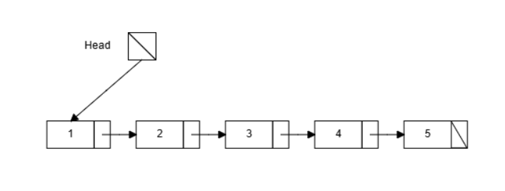
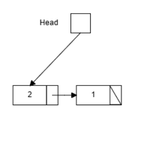
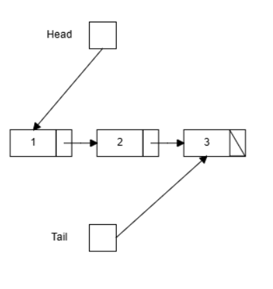
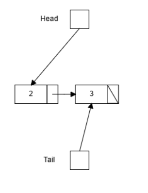

<div align="right">

</div>

# TDA LISTA/PILA/COLA

## Repositorio de (Jose Gonzalez Casartelli) - (113633) - (jgcasartelli06@gmail.com)

- Para compilar:

```bash
make
```

- Para ejecutar:

```bash
make run ARGS="..." 
```

ejemplo de uso --> make run ARGS="pokemones.csv buscar nombre Pikachu"

- Para ejecutar con valgrind:
```bash
make valgrind ARGS="..."
```
---
##  Funcionamiento

El programa funciona abriendo un archivo pasado por parametro y lo lee linea por linea.  Parsea cada lina segun los campos del struct y los intenta guardar en un vector.  Esto lo hace reutilizando la funcion leer_archivo() del tp1 que se usa para luego cargar la lista con todos los elementos.  Se hace llamando a la funcion lista_crear() que crear una lista donde inicializamos un puntero que apunta al primer elemento de la lista, uno que apunta al ultimo y la cantidad.  La estructura esta definida de esta forma para poder tener una complejidad de O(1) en las operaciones encolar, desencolar y frente de la cola, y apilar, desapilar y tope de la pila.   

```c
lista_t *lista_crear()
{
    lista_t *lista = malloc(sizeof(lista_t));
    if (!lista)
        return NULL;
    
    lista->primero = NULL;
    lista->ultimo = NULL;
    lista->cantidad = 0;

    return lista;

}
```

La lista es simplemente enlazada donde contiene nodos y cada nodo almacena un dato y un puntero al siguiente nodo.  Por la forma en la que esta definida la estructura, las funciones lista_agregar() y lista_cantidad() tienen complejidad O(1).  Lista_cantidad() simplemente devuelva la cantidad de nodos en la lista accediendo directo al campo cantidad.  Lista_agregar() agrega un elemento al final de la lista.  La razon por la que esta funcion es O(1) es porque tenemos un puntero al ultimo nodo y ese nodo contiene un puntero que en ese momento apunta a NULL. Lo que se hace es que lista->ultimo->siguiente apunte al nuevo nodo, y que ahora lista->ultimo apunte al nuevo nodo.  De esta forma se pudo agregar un nuevo nodo al final de la lista de forma directa sin tener que recorrer toda lista lista.

En el siguiente ejemplo se puede ver como se inserta el 5 al final.

<div align="center">

</div>


<div align="center">

</div>


Estructuras de memoria con ejemplo de codigo

```c
lista_t* lista = lista_crear();
int a = 10;
lista_agregar(lista, &a);

```

STACK                           HEAP
lista (un puntero)              lista_t (estructura de la lista)
a (int)                         nodo (el que se agrega a la lista)


La pila la implemente usando la estructura de la lista con la diferencia de como es una lista los elementos se apilan y despilan desde el tope.  Es decir solamente se puede agregar a la posicion 0, y eliminar de la posicion 0.  Las funciones de la pila apilar y desapilar reutilizan las funciones lista_insertar() y lista_eliminar_elemento() y las operaciones tienen complejidad O(n).  Esto es por como mencione antes la estructura de la lista que contiene un puntero que apunta al primer elemento de la lista o en este caso la pila.  Abajo se podra ver como el 3 fue el ultimo en ser ingresado por lo tanto esta en el tope.  Luego cuando se desapila, el 3 se va y el nuevo tope es el 2.  


<div align="center">

</div>

<div align="center">

</div>


Estructuras de memoria con ejemplos de codigo

```c
pila_t* pila = pila_crear();
int a = 10;
pila_apilar(pila, &a);

```

STACK                           HEAP
pila (un puntero)               pila_t (estructura de la pila)
a (int)                         nodo (el que se agrega a la lista)


La cola al igual que la pila se implemento con la estructura de la lista.  La diferencia es que en la cola los elementos se agregan en la ultima posicion y salen de la primera.  Por lo tanto en este caso se usaron las funciones lista_agregar() y lista_eliminar_elemento() para encolar y desencolar.  Ambas operaciones son de complejidad O(1) gracias a la estructura de la lista que permite acceder de forma directa al primer y ultimo elemento de dicha lista.  Abajo se podra ver un diagrama de como se implementa esta estructura de forma de que el elemento 1 fue el primero ingresado, y es el primero en salir al eliminar un elemento.

<div align="center">

</div>


<div align="center">

</div>

Estructuras de memoria con ejemplos de codigo

```c
cola_t* cola = cola_crear();
int a = 10;
cola_encolar(cola, &a);

```

STACK                           HEAP
cola (un puntero)               cola_t (estructura de la cola)
a (int)                         nodo (el que se agrega a la lista)


## Respuestas a las preguntas teóricas

Una lista es una estructura de datos lineal que almacena datos en un orden secuencial.  Una lista simplemente enlazada en una implementacion de la lista usando nodos, donde cada uno de los nodos guarda un dato y un puntero al siguiente nodo.  Se puede insertar y eliminar en cualquier posicion con complejidad O(1) si se tiene el nodo anterior usando el puntero almacenado.  A diferencia de una lista simplemente enlazada, una lista doblemente enlazada ademas de guardar un dato y un puntero al siguiente nodo, tambien tiene un puntero al anterior nodo que permite recorrer la lista para adelante y para atras.  

Las ventajas y desventajas de cada una son las siguientes:

Ventajas (lista simplemente enlzada)
Menor uso de memoria y una implementacion mas simple

Desventajas (lista simplemente enlzada)
No se puede recorrer para atras tan facilmente

Ventajas (lista doblemente enlzada)
Recorrido en ambos sentidos

Desventajas (lista doblemente enlzada)
Mayor consumo de memoria


Una lista circular es una variacion de la lista enlazada donde el ultimo nodo apunta al primero en lugar de apuntar a NULL.
Se puede implementar de dos maneras.  La primera es la lista circular simplemente enlazada donde el puntero siguiente del ultimo nodo apunta devuelta primero.  La segunda es la lista circular doblemente enlazada que ademas tiene que el primer nodo contiene un puntero que apunta al ultimo nodo.  La ventaja de la lista circular es que se puede recorrer la lista indefinidamente de manera circular como indica el nombre.

La diferencia de funcionamiento entre cola y pila es el orden de como entran y salen los datos almacendados.  En la cola se sigue FIFO (First in first out) que quiere decir que el primero en entrar es el primero en salir.  Esto se puede imaginar como una cola en un supermercado donde el primero en llegar es el primero en ser atentido.  Por lo tanto la operacion encolar indica agregar al final, y desencolar sacar del principio.  La pila sigue LIFO (Last in first out).  Aca el primero en llegar es el ultimo en salir, como una pila de platos donde el primero que apoyaste es el ultimo que sacas.  La operacion apilar significa agregar arriba y desapilar es sacar de arriba.

Un iterador interno es una funcion de la lista que recorre todos los elementos y aplica una funcion a cada uno.  El control del recorrido esta adentro de la lista.  Un ejemplo de esto es la funcion lista_con_cada_elemento().  En cambio un iterador externo es separado y mantiene su propia posicion en la lista.
